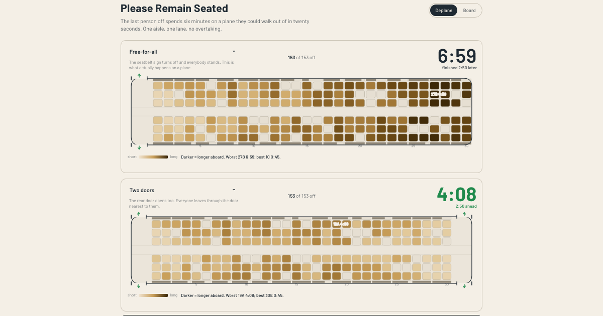

# Please Remain Seated

**Two cabins, the same 180 passengers, two exit orders. Race them and watch where the time goes.**

<p align="center">
  
  
  
</p>

---

An agent-based simulator of deplaning and boarding a plane. Every passenger is a person with a seat, some number of bags, a walking speed, and a patience for waiting their turn. The aisle is a single-lane road, one cell wide, no passing. A passenger digging a roller bag out of the overhead bin is a stopped car in that lane, and nothing behind them moves until they're done. That's the whole thesis, and the hero of the page is a race that makes it visible: two cabins, the same passengers, the same seed, two different exit or boarding orders, side by side.



## The strategies

### Deplaning

| Strategy | What it does |
|---|---|
| Free-for-all | The seatbelt sign turns off and everybody stands. What actually happens on a plane. |
| Row-by-row | Row 1 leaves, then row 2 waits until every row-1 passenger is out of the seat, then row 3 waits on row 2, and so on. |
| Aisle first | Aisle seats leave first, then middles, then windows. |
| Alternating rows | Even rows first, then odd rows, so bag retrievals happen one row apart. |
| Two doors | The rear door opens too. Everyone leaves through whichever door is nearer. |
| Bagless first | Anyone with no overhead bag leaves before anyone with a bag stands up. |
| Back-to-front | The back row leaves first; the row ahead of it waits until every rear neighbor is out. The mirror of row-by-row. |

### Boarding

| Strategy | What it does |
|---|---|
| Random | Passengers board in whatever order they show up at the gate. |
| Back to front (5 zones) | Five row bands, boarded back to front, random inside each band. |
| Front to back (5 zones) | The same five bands, boarded front first. The classic bad idea. |
| WILMA | All window seats first, then all middles, then all aisles, random inside each wave. |
| Steffen optimal | Windows first, then middles, then aisles; alternating sides and rows inside each wave so nobody stands next to their neighbor. |
| Steffen modified | A relaxed Steffen: four waves, four rows apart, each boarded outside-in. |
| Reverse pyramid | Back-window corner first, moving diagonally forward and inward. |
| Rotating zone | Four bands, back quarter then front quarter then the two middle bands, alternating toward the center. |
| Open seating (Southwest) | No assigned seats. Passengers spread through the cabin and pick a seat that needs nobody to stand: an empty row (window first), or the aisle seat of a row already half full. |

## Aircraft

| Preset | Layout | Rows | Seats |
|---|---|---|---|
| CRJ-700 | 2-2 | 17 | 68 |
| E175 | 2-2 | 19 | 76 |
| Boeing 717 | 2-3 | 26 | 130 |
| A320 / 737-800 (default) | 3-3 | 30 | 180 |
| 737-800 high-density | 3-3 | 33 | 198 |
| A321neo | 3-3 | 37 | 222 |
| Boeing 767 | 2-3-2 | 28 | 196 |
| Boeing 787 | 3-3-3 | 30 | 270 |
| Boeing 777 | 3-4-3 | 36 | 360 |

Load factor, rear-door use, and bin era (Space Bin vs. legacy) sit as sliders on top of any preset.

## What the numbers are calibrated against

Walking speed, bag stow and retrieval time, seat-interference movement counts, and door outflow all come from published field measurements, not guesses. Where no measurement exists (a distracted-passenger tail, politeness, group size), it's marked as an assumption in [js/engine/config.js](js/engine/config.js) and [design/02-research.md](design/02-research.md).

| What's calibrated | Source |
|---|---|
| Walking speed, bag stow time (Weibull), door outflow (23 pax/min median) | Schultz, [Field Trial Measurements to Validate a Stochastic Aircraft Boarding Model](https://doi.org/10.3390/aerospace5010027), Aerospace 5(1):27, 2018 |
| Seat-interference movement counts | Schultz, [Consideration of Passenger Interactions](https://doi.org/10.3390/aerospace5040101), Aerospace 5(4):101, 2018 |
| Structured (one-column, aisle-first) deplaning claim | Wald, Harmon & Klabjan, [JATM 36:101-109](https://www.sciencedirect.com/science/article/abs/pii/S0969699714000027), 2014 ([doi 10.1016/j.jairtraman.2014.01.001](https://doi.org/10.1016/j.jairtraman.2014.01.001)) reports a >40% reduction from structured deplaning; this model finds about 4% at default settings (aisle-first ~6:09 vs free-for-all ~6:24 on the A320 deplane headline cell), because 0.85 compliance and 25% family groups blur the strict order and the row-pair aisle already lets seat-mates retrieve bags in parallel. |
| Boarding-method ordering (Steffen fastest, back-to-front slowest) | Steffen, [JATM 14(3)](https://arxiv.org/abs/0802.0733), 2008; Steffen & Hotchkiss, [JATM 18(1)](https://arxiv.org/abs/1108.5211), 2012 |
| Random / WILMA / open-seating boarding times | [MythBusters episode 222](https://mythresults.com/airplane-boarding), 2014 |

Every strategy's total time is checked against these bounds by the calibration tests, `tests/unit/calibration-deplane.test.js` and `tests/unit/calibration-board.test.js`. See those files for the seed count each bound is asserted against; per-gate counts and families change independently and are stated inline in the tests, not duplicated here.

The whole-run deplaning gate derives from the two sources above, not from a widened tolerance:

- The A320 default carries 153 passengers (180 seats at 0.85 load factor).
- Schultz 2018 measured a median door outflow of 23 pax/min (Q1 18, Q3 29) in the first minute of outflow.
- Wald, Harmon and Klabjan 2014 (JATM 36:101-109) report a 15 to 17 pax/min average deplaning rate on a full A320; at 144 seats that arithmetic gives an 8.5 to 9.6 minute total, a derived figure rather than one they measure directly.
- The whole-run gate spans 14 to 27 pax/min (Wald, Harmon and Klabjan low end to comfortably above Schultz's median; Schultz's Q3 is 29), the first-two-minute gate spans 15 to 30 pax/min, and the total-minutes sanity bound spans 5 to 13 minutes, all measured from door open. Each bound is asserted across six independent seed families (calib, stagger, critic2, critic3, family-a, family-b), so a single lucky family cannot flip the gate; per-family seed counts live in the test file so this README stays honest as they evolve.
- The model runs at the fast end of that band. Whole-run throughput lands around 23 to 25 pax/min at defaults, close to Schultz's median and above the Wald, Harmon and Klabjan range; the 45-second door-open staging window in `js/engine/config.js` is what puts it there.

## Run it locally

```sh
python3 -m http.server 5197                                        # serve the page
npm test                                                            # unit tests (engine + calibration gates)
npm run test:e2e                                                    # Playwright smoke test
node tools/simulate.mjs --mode deplane --strategy all --seeds 30    # headless Monte Carlo table
```

No build step, no framework, no runtime dependencies. Playwright is a dev dependency for the end-to-end test and screenshots only.

## What it doesn't model

- Children, or anyone needing mobility assistance
- Gate-checked bags (every bag goes through the same overhead-bin search as everyone else's)
- Cabin crew directing traffic or clearing the aisle
- The jet-bridge queue itself, beyond a fixed service time per passenger crossing the door

## License

MIT © Owen Wang
